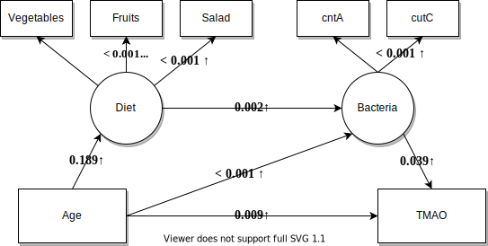

```{css, echo = FALSE}
.header-panel {
    background-color: #940a21;
    min-height: 144px;
    position: relative;
    z-index: 3;
}
```


```{r setup, include=FALSE}
knitr::opts_chunk$set(
	echo = TRUE,
	message = FALSE,
	warning = FALSE
)
```

```{r Load libraries, include=FALSE}
library(tidyverse)
library(haven)
library(Hmisc)
library(dplyr)
library(knitr)
library(DiagrammeR)
library(summarytools)
library(hablar)
library(labelled)
library(car)
library(xtable)
library(huxtable)
library(corrplot)
library(FactoMineR)
library(sjPlot)
library(MASS)
library(kableExtra)
library(reshape2)
library("rgl")

st_options(bootstrap.css     = FALSE,       # Already part of the theme so no need for it
           plain.ascii       = FALSE,       # One of the essential settings
           style             = "rmarkdown", # Idem.
           dfSummary.silent  = TRUE,        # Suppresses messages about temporary files
           footnote          = NA,          # Keeping the results minimalistic
           subtitle.emphasis = FALSE,       # For the vignette theme, this gives
           headings = F)       
                                           
```

```{r Load data, include=FALSE}
mydata <- read_dta(file = "ship_2019_137_md_s2t0_20200327.dta")
#summary(mydata)
glimpse(mydata)
data <- mydata %>% dplyr::select(c("zz_nr","stool_dna_tma_cutc","stool_dna_tma_cnta","stool_dna_tma_grdh","omics_tma_tmao","omics_tma_choline","omics_tma_betaine","omics_tma_carnitine","stool_dna_tma_16s_rdna"))
#dataselall <- data %>%
#        filter(stool_dna_tma_cutc < 99975 | stool_dna_tma_cutc > 99999)  %>%
#        filter(stool_dna_tma_cnta < 99975 | stool_dna_tma_cnta > 99999) %>%
#        filter(stool_dna_tma_grdh < 99975 | stool_dna_tma_grdh > 99999) %>%
#        filter(omics_tma_tmao < 99975 | omics_tma_tmao > 99999)  %>%
#        filter(omics_tma_choline < 99975 | omics_tma_choline > 99999) %>%
#        filter(omics_tma_betaine < 99975 | omics_tma_betaine > 99999) %>%
#        filter(omics_tma_carnitine < 99975 | omics_tma_carnitine > 99999) 


#data %>% filter(stool_dna_tma_16s_rdna > 99975 | stool_dna_tma_16s_rdna < 99999) %>% summarize( cutc = sum(stool_dna_tma_cutc < 99975 | stool_dna_tma_cutc > 99999))

#select based on 16S as all have it
dataselall <- data %>% filter(stool_dna_tma_16s_rdna < 99975 | stool_dna_tma_16s_rdna > 99999)
#dataselall <- data

###change special coding to NAs
sel <- names(dataselall)
dataselall[sel] <- lapply(dataselall[sel], function(x) replace(x,x %in% 99975:99999, NA))


###get Proband_IDs
probands_zz_nr <- dataselall$zz_nr ### 425 Probands

###get SHIPdata
SHIPt <- read_dta(file = "ship_2016_114_md_t0_20200206.dta")
SHIPs0 <- read_dta(file = "ship_2016_114_md_s0_20200206.dta")
SHIPs2 <- read_dta(file = "ship_2016_114_md_s2_20200206.dta")

###select for probands
P_SHIPt <- SHIPt %>% filter(zz_nr %in% probands_zz_nr) ### 374 Probands
P_SHIPs2 <- SHIPs2 %>% filter(zz_nr %in% probands_zz_nr) ### 51 Probands
P_SHIPs0 <- SHIPs0 %>% filter(zz_nr %in% probands_zz_nr) ### 51 Probands > same as s2 but sampled 5 years earlier - probably leave out as too few for longitudinal analyses

###select for key variables and bind rows
P_SHIPt_var <- P_SHIPt %>% dplyr::select(c("zz_nr","SEX_SHIP_T0","AGE_SHIP_T0",
                                    "t0_alko_02", # Alohol
                                    "t0_rau_01", # Raucher
                                    "t0_ernaehr_01", # Fleisch
                                    "t0_ernaehr_07", # Reis 
                                    "t0_ernaehr_08", # Salat / Gemüse, roh 
                                    "t0_ernaehr_09", # Gemüse, gekocht 
                                    "t0_ernaehr_11", # Vollkornbrot 
                                    "t0_ernaehr_10", # Obst
                                    "t0_ernaehr_13",
                                    #"ffs_pattern_t0",
                                    #"ffs_t0",
                                    "t0_diab_02","t0_stro_02","t0_mi_02","cca_lmean","cca_rmean"))
P_SHIPs2_var <- P_SHIPs2 %>% dplyr::select(c("zz_nr","SEX_SHIP2","AGE_SHIP2",
                                      "s2_alko_02", # Alohol
                                      "s2_rau_01", # Raucher
                                      "s2_ernaehr_01",
                                      "s2_ernaehr_07",
                                      "s2_ernaehr_08",
                                      "s2_ernaehr_09",
                                      "s2_ernaehr_11",
                                      "s2_ernaehr_10",
                                      "s2_ernaehr_13",
                                      #"ffs_pattern_s2",
                                      #"ffs_s2",
                                      "s2_diab_02","s2_stro_02","s2_mi_02","cca_lmean","cca_rmean"))

P_SHIPt_SHIP2_var <- rbind(as.matrix(P_SHIPt_var),as.matrix(P_SHIPs2_var)) %>% as_tibble()
P_SHIPt_SHIP2_var_tma <- P_SHIPt_SHIP2_var %>% left_join(dataselall)

###some cleaning
P_SHIPt_SHIP2_var_tma$t0_diab_02[P_SHIPt_SHIP2_var_tma$t0_diab_02 > 0] <- 1 # t0_diab_02 IST NUR INDIKATOR FÜR BEHANDLUNGSART
P_SHIPt_SHIP2_var_tma$t0_mi_02[P_SHIPt_SHIP2_var_tma$t0_mi_02 > 0] <- 1
P_SHIPt_SHIP2_var_tma$t0_stro_02[P_SHIPt_SHIP2_var_tma$t0_stro_02 > 0] <- 1

P_SHIPt_SHIP2_var_tma$t0_diab_02[is.na(P_SHIPt_SHIP2_var_tma$t0_diab_02)] <- 0
P_SHIPt_SHIP2_var_tma$t0_mi_02[is.na(P_SHIPt_SHIP2_var_tma$t0_mi_02)] <- 0
P_SHIPt_SHIP2_var_tma$t0_stro_02[is.na(P_SHIPt_SHIP2_var_tma$t0_stro_02)] <- 0

outliers <- function(model) {
     cooksd <- cooks.distance(model)
     plot(cooksd, pch="*", cex=2, main="Influential Obs by Cooks distance")  # plot cook's distance
     abline(h = 4*mean(cooksd, na.rm=T), col="red")  # add cutoff line
     text(x=1:length(cooksd)+1, y=cooksd-mean(cooksd), labels=ifelse(cooksd>4*mean(cooksd, na.rm=T),names(cooksd),""), col="red")    
}

```

# Explore variables

```{r}
detect_limit_cnta <- min(P_SHIPt_SHIP2_var_tma$stool_dna_tma_cnta[P_SHIPt_SHIP2_var_tma$stool_dna_tma_cnta > 0])
detect_limit_grdh <- min(P_SHIPt_SHIP2_var_tma$stool_dna_tma_grdh[P_SHIPt_SHIP2_var_tma$stool_dna_tma_grdh > 0])

data <-  P_SHIPt_SHIP2_var_tma %>%
         transmute(zz_nr = zz_nr,
                   meat = case_when(t0_ernaehr_01 == 1 ~ 4,  # Täglich Fleisch
                                    t0_ernaehr_01 == 4 ~ 3,
                                    t0_ernaehr_01 == 5 ~ 2,
                                    t0_ernaehr_01 == 6 ~ 1), # Nie oder fast nie Fleisch
                   eggs = case_when(t0_ernaehr_13 == 6 ~ 1,
                                    t0_ernaehr_13 == 5 ~ 2,
                                    t0_ernaehr_13 == 4 ~ 3,
                                    t0_ernaehr_13 == 3 ~ 4,
                                    t0_ernaehr_13 == 2 ~ 5,
                                    t0_ernaehr_13 == 1 ~ 6),
                   meat_cat = case_when(t0_ernaehr_01 == 1 ~ 1,
                                        t0_ernaehr_01 == 4 ~ 0,
                                        t0_ernaehr_01 == 5 ~ 0,
                                        t0_ernaehr_01 == 6 ~ 0),
          gender = case_when(SEX_SHIP_T0 == 2 ~ 0,  #Weiblich
                             SEX_SHIP_T0 == 1 ~ 1), # Männlich
          rdna = stool_dna_tma_16s_rdna,
          age = AGE_SHIP_T0,
          cutc = stool_dna_tma_cutc,
          cnta = case_when(stool_dna_tma_cnta > 0 ~ stool_dna_tma_cnta,
                           stool_dna_tma_cnta == 0 ~ detect_limit_cnta/sqrt(2)),
          grdh = case_when(stool_dna_tma_grdh > 0 ~ stool_dna_tma_grdh,
                           stool_dna_tma_grdh == 0 ~ detect_limit_grdh/sqrt(2)),
          tmao = omics_tma_tmao,
          choline = omics_tma_choline,
          betaine = omics_tma_betaine,
          carnitine = omics_tma_carnitine,
          IMT_mean = (cca_lmean+cca_rmean)/2,
          diabetes = t0_diab_02,
          stroke = t0_stro_02,
          mi = t0_mi_02,
          ID = zz_nr) %>%
          convert(fct(stroke,mi,diabetes)) %>%
          set_variable_labels(IMT_mean = "IMT_mean")# %>%
  #mutate(cutc = cutc/rdna,
  #      cnta = cnta/rdna,
  #     grdh = grdh/rdna)

```


```{r Metabolites, echo=FALSE}
data %>%
  dplyr::select(meat,meat_cat,eggs,age,stroke,mi,diabetes,choline,betaine,carnitine,tmao,cutc,cnta,IMT_mean) %>%
  dfSummary() %>%
  print(max.tbl.width = 20,method="render")
```


## Correlations

```{r}
data_corr <- data %>% convert(num(mi,stroke,diabetes)) %>% dplyr::select(-zz_nr) %>%
        dplyr::select_if(is.numeric) %>% dplyr::select(-ID) %>% as.matrix() %>% cor(method="spearman",use="pairwise.complete.obs")

corrplot(data_corr,method="number")
```

```{r}
reverse_scale <- function(x) {abs((max(x)+1)-x)}
data <- data %>% left_join(P_SHIPt_SHIP2_var_tma)
data <- data %>% mutate(alcohol = reverse_scale(t0_alko_02),
                smoker = case_when(t0_rau_01 == 2 ~ 0,
                                   t0_rau_01 == 1 ~ 1),
                rice = reverse_scale(t0_ernaehr_07),
                salad = reverse_scale(t0_ernaehr_08),
                vegetables = reverse_scale(t0_ernaehr_09),
                full_grain = reverse_scale(t0_ernaehr_11),
                fruits = reverse_scale(t0_ernaehr_10))

```


# Effects of TMAO on IMT
```{r}
fit1 <- lm(IMT_mean~log2(tmao),data=data)
fit2 <- lm(IMT_mean~log2(tmao)+age,data=data)
fit3 <- lm(IMT_mean~log2(tmao)+age+gender,data=data)

tab_model(fit1,fit2,fit3)
```

```{r}
data %>%
  dplyr::select(tmao,IMT_mean) %>%
  ggplot(aes(x=tmao,y=IMT_mean),data=.) +
  geom_point() +
  scale_x_log10() +
  geom_smooth() +
  xlab("log(TMAO)")

data %>%
  dplyr::select(age,IMT_mean) %>%
  ggplot(aes(x=age,y=IMT_mean),data=.) +
  geom_point() +
  geom_smooth() +
  xlab("(age)")
```


# Effect of meat intake on IMT
```{r}
fit1 <- lm((IMT_mean)~meat_cat,data=data)
fit2 <- lm((IMT_mean)~meat_cat+age,data=data)
fit3 <- lm((IMT_mean)~meat_cat+age+gender,data=data)

tab_model(fit1,fit2,fit3)
```

```{r}
data %>%
  dplyr::select(IMT_mean,meat_cat,age,gender) %>%
  ggplot(aes(x=as.factor(meat_cat),y=IMT_mean,fill=as.factor(meat_cat)),data=.) +
  geom_boxplot()

data %>%
  dplyr::select(IMT_mean,meat_cat,age,gender) %>%
  ggplot(aes(x=age,y=IMT_mean,color=as.factor(meat_cat)),data=.) +
  geom_point() +
  geom_smooth()
```


# Effects of meat intake on metabolites
## Choline
```{r}
fit1 <- lm(log(choline)~meat_cat,data=data)
fit2 <- lm(log(choline)~meat_cat+age,data=data)
fit3 <- lm(log(choline)~meat_cat+gender+age,data=data)

tab_model(fit1,fit2,fit3)
```

```{r}
data %>%
  dplyr::select(choline,meat_cat,age,gender) %>%
  ggplot(aes(fill=as.factor(meat_cat),y=choline),data=.) +
  scale_y_log10() +
  geom_boxplot() 

data %>%
  dplyr::select(choline,meat_cat,age,gender) %>%
  ggplot(aes(color=as.factor(meat_cat),x=age,y=choline),data=.) +
  scale_y_log10() +
  geom_point() +
  geom_smooth()

data %>%
  dplyr::select(choline,meat_cat,age,gender) %>%
  ggplot(aes(color=as.factor(gender),x=age,y=choline),data=.) +
  scale_y_log10() +
  geom_point() +
  geom_smooth()


```

## Carnitine
```{r}
fit1 <- lm(log(carnitine)~meat_cat,data=data)
fit2 <- lm(log(carnitine)~meat_cat+age,data=data)
fit3 <- lm(log(carnitine)~meat_cat+gender+age,data=data)

tab_model(fit1,fit2,fit3)
```

```{r}
data %>%
  dplyr::select(carnitine,meat_cat,age,gender) %>%
  ggplot(aes(fill=as.factor(meat_cat),y=carnitine),data=.) +
  scale_y_log10() +
  geom_boxplot() 

data %>%
  dplyr::select(carnitine,meat_cat,age,gender) %>%
  ggplot(aes(color=as.factor(meat_cat),x=age,y=carnitine),data=.) +
  geom_point() +
  scale_y_log10() +
  geom_smooth()

data %>%
  dplyr::select(carnitine,meat_cat,age,gender) %>%
  ggplot(aes(color=as.factor(gender),x=age,y=carnitine),data=.) +
  geom_point() +
  scale_y_log10() +
  geom_smooth()
```

## Betaine
```{r}
fit1 <- lm(log(betaine)~meat_cat,data=data)
fit2 <- lm(log(betaine)~meat_cat+age,data=data)
fit3 <- lm(log(betaine)~meat_cat+gender+age,data=data)

tab_model(fit1,fit2,fit3)
```

```{r}
data %>%
  dplyr::select(betaine,meat_cat,age,gender) %>%
  ggplot(aes(fill=as.factor(meat_cat),y=betaine),data=.) +
  scale_y_log10() +
  geom_boxplot() 

data %>%
  dplyr::select(betaine,meat_cat,age,gender) %>%
  ggplot(aes(color=as.factor(meat_cat),x=age,y=betaine),data=.) +
  geom_point() +
  scale_y_log10() +
  geom_smooth()

data %>%
  dplyr::select(betaine,meat_cat,age,gender) %>%
  ggplot(aes(color=as.factor(gender),x=age,y=betaine),data=.) +
  geom_point() +
  scale_y_log10() +
  geom_smooth()

data %>%
  dplyr::select(betaine,meat_cat,age,gender) %>%
  ggplot(aes(color=as.factor(gender),x=age,y=betaine),data=.) +
  geom_point() +
  scale_y_log10() +
  geom_smooth()


```


# Effects of meat intake on bacteria
## cutC
```{r}
fit1 <- lm(log(cutc)~meat_cat,data=data)
fit2 <- lm(log(cutc)~meat_cat+age,data=data)
fit3 <- lm(log(cutc)~meat_cat+age+gender,data=data)

tab_model(fit1,fit2,fit3)
```

```{r}
data %>%
  dplyr::select(cutc,meat_cat,age,gender) %>%
  ggplot(aes(fill=as.factor(meat_cat),y=cutc)) +
  geom_boxplot() +
  scale_y_log10()


data %>%
  dplyr::select(cutc,meat_cat,age,gender) %>%
  ggplot(aes(color=as.factor(meat_cat),x=age,y=cutc),data=.) +
  geom_point() +
  scale_y_log10() +
  geom_smooth()

data %>%
  dplyr::select(cutc,meat_cat,age,gender) %>%
  ggplot(aes(color=as.factor(gender),x=age,y=cutc),data=.) +
  geom_point() +
  scale_y_log10() +
  geom_smooth()

```

## cntA
```{r}
fit1 <- lm(log(cnta)~meat_cat,data=data)
fit2 <- lm(log(cnta)~meat_cat+age,data=data)
fit3 <- lm(log(cnta)~meat_cat+age+gender,data=data)

tab_model(fit1,fit2,fit3)
```

```{r}
data %>%
  dplyr::select(cnta,meat_cat,age,gender) %>%
  ggplot(aes(fill=as.factor(meat_cat),y=cnta)) +
  geom_boxplot() +
  scale_y_log10()


data %>%
  dplyr::select(cnta,meat_cat,age,gender) %>%
  ggplot(aes(color=as.factor(meat_cat),x=age,y=cnta),data=.) +
  geom_point() +
  scale_y_log10() +
  geom_smooth()

data %>%
  dplyr::select(cnta,meat_cat,age,gender) %>%
  ggplot(aes(color=as.factor(gender),x=age,y=cnta),data=.) +
  geom_point() +
  scale_y_log10() +
  geom_smooth()
```

## grdH
```{r}
fit1 <- lm(log(grdh)~meat_cat,data=data)
fit2 <- lm(log(grdh)~meat_cat+age,data=data)
fit3 <- lm(log(grdh)~meat_cat+age+gender,data=data)

tab_model(fit1,fit2,fit3)
```

# Effects of metabolites on TMAO
```{r}
fit_tmao1 <- lm(log(tmao)~scale(choline),data=data)
fit_tmao2 <- lm(log(tmao)~scale(carnitine),data=data)
fit_tmao3 <- lm(log(tmao)~scale(betaine),data=data)
fit_tmao4 <- lm(log(tmao)~scale(choline)+scale(betaine)+scale(carnitine),data=data)
fit_tmao5 <- lm(log(tmao)~scale(choline)*scale(betaine)*scale(carnitine),data=data)

tab_model(fit_tmao1,fit_tmao2,fit_tmao3,fit_tmao4,fit_tmao5)
```

## Effect of choline on tmao
```{r}
fit_tmao1 <- lm(log(tmao)~scale(choline),data=data)
fit_tmao2 <- lm(log(tmao)~scale(choline)+age,data=data)
fit_tmao3 <- lm(log(tmao)~scale(choline)+age+gender,data=data)

tab_model(fit_tmao1,fit_tmao2,fit_tmao3)
```

```{r}
data %>%
  dplyr::select(tmao,choline) %>%
  ggplot(aes(x=choline,y=tmao),data=.) +
  geom_point() +
  geom_smooth() +
  scale_y_log10()
```


# Effects of bacteria on TMAO
## cutC
```{r}
fit1 <- lm(log(tmao)~log(cutc),data=data)
fit2 <- lm(log(tmao)~log(cutc)+age,data=data)
fit3 <- lm(log(tmao)~log(cutc)+age+gender,data=data)
tab_model(fit1,fit2,fit3)
```

```{r}
data %>%
  dplyr::select(tmao,cutc,age,gender,meat_cat) %>%
  ggplot(aes(x=cutc,y=tmao),data=.) +
  geom_point() +
  scale_y_log10() +
  scale_x_log10() +
  geom_smooth()
```

## cntA
```{r}
fit1 <- lm(log(tmao)~log(cnta),data=data)
fit2 <- lm(log(tmao)~log(cnta)+age,data=data)
fit3 <- lm(log(tmao)~log(cnta)+age+gender,data=data)

tab_model(fit1,fit2,fit3)
```

```{r}
data %>%
  dplyr::select(tmao,cnta,age,gender,meat_cat) %>%
  ggplot(aes(x=cnta,y=tmao),data=.) +
  geom_point() +
  scale_y_log10() +
  scale_x_log10() +
  geom_smooth()
```

## grdH
```{r}
fit1 <- lm(log(tmao)~log(grdh),data=data)
fit2 <- lm(log(tmao)~log(grdh)+age,data=data)
fit3 <- lm(log(tmao)~log(grdh)+age+gender,data=data)

tab_model(fit1,fit2,fit3)
```


# Effects of overall diet on bacteria
## cutC
```{r}
data %>%
        dplyr::select(meat_cat, smoker, fruits,rice,salad,vegetables,full_grain,eggs) %>%
        map(~lm(log(data$cutc) ~ .x,data=data)) %>%
        map(summary) %>%
        map(coef) %>%
        map_dbl(function(x) x[[2,4]]) %>%
        tidy %>%
        rename(p_value = x) %>%
        arrange(p_value) %>%
        mutate(p_value = cell_spec(round(p_value,4),"html",color = ifelse(p_value > 0.05,"black","lightgreen"))) %>%
        column_to_rownames("names") %>%
        t %>%
        kable(format = "html", escape = F) %>%
        kable_styling(full_width = F)


data %>%
        dplyr::select(cutc,meat_cat, smoker, fruits,rice,salad,vegetables,full_grain,eggs) %>%
        melt(id="cutc") %>%
         ggplot(aes(x=as.factor(value),y=cutc,fill=as.factor(value)),data=.) +
        geom_boxplot(binaxis = "y", stackdir = "center") +
        scale_y_log10() +
        facet_grid(~variable,scales="free") 
```

## cntA
```{r}
data %>%
        dplyr::select(meat_cat, smoker, fruits,rice,salad,vegetables,full_grain,eggs) %>%
        map(~lm(log(data$cnta) ~ .x,data=data)) %>%
        map(summary) %>%
        map(coef) %>%
        map_dbl(function(x) x[[2,4]]) %>%
        tidy %>%
        rename(p_value = x) %>%
        arrange(p_value) %>%
        mutate(p_value = cell_spec(round(p_value,4),"html",color = ifelse(p_value > 0.05,"black","lightgreen"))) %>%
        column_to_rownames("names") %>%
        t %>%
        kable(format = "html", escape = F) %>%
        kable_styling(full_width = F)

data %>%
        dplyr::select(cnta,meat_cat, smoker, fruits,rice,salad,vegetables,full_grain,eggs) %>%
        melt(id="cnta") %>%
        ggplot(aes(x=as.factor(value),y=cnta,fill=as.factor(value)),data=.) +
        geom_boxplot(binaxis = "y", stackdir = "center") +
        scale_y_log10() +
        facet_grid(~variable,scales="free")
```

## grdH
```{r}
data %>%
        dplyr::select(meat_cat, smoker, fruits,rice,salad,vegetables,full_grain,eggs) %>%
        map(~lm(log(data$grdh) ~ .x,data=data)) %>%
        map(summary) %>%
        map(coef) %>%
        map_dbl(function(x) x[[2,4]]) %>%
        tidy %>%
        rename(p_value = x) %>%
        arrange(p_value) %>%
        mutate(p_value = cell_spec(round(p_value,4),"html",color = ifelse(p_value > 0.05,"black","lightgreen"))) %>%
        column_to_rownames("names") %>%
        t %>%
        kable(format = "html", escape = F) %>%
        kable_styling(full_width = F)

data %>%
        dplyr::select(grdh,meat_cat, smoker, fruits,rice,salad,vegetables,full_grain,eggs) %>%
        melt(id="grdh") %>%
        ggplot(aes(x=as.factor(value),y=grdh,fill=as.factor(value)),data=.) +
        geom_boxplot(binaxis = "y", stackdir = "center") +
        scale_y_log10() +
        facet_grid(~variable,scales="free")
```

## Table

```{r}
library(table1)

tab.dat <- data
tab.dat$meat_cat <- factor(tab.dat$meat_cat, levels=c(0,1), labels = c("Low","High"))
tab.dat$gender <- factor(tab.dat$gender, levels=c(0,1), labels = c("Female","Male"))
tab.dat$smoker <- factor(tab.dat$smoker, levels=c(0,1), labels = c("No","Yes"))

table1(~ (meat_cat) + (smoker) + fruits + rice + salad + vegetables + full_grain + eggs | (gender),data=tab.dat)
```

## Combined effects on bacteria

```{r}
fit1 <- lm(log(cutc)~meat_cat,data=data)
fit2 <- lm(log(cutc)~meat_cat+smoker,data=data)
fit3 <- lm(log(cutc)~meat_cat+smoker+fruits,data=data)
fit4 <- lm(log(cutc)~meat_cat+smoker+fruits+gender+vegetables,data=data)
fit5 <- lm(log(cutc)~smoker+fruits+gender+vegetables,data=data)

tab_model(fit1,fit2,fit3,fit4)
tab_model(fit5)
```

```{r}
fit1 <- lm(log(cnta)~meat_cat,data=data)
fit2 <- lm(log(cnta)~meat_cat+salad,data=data)
fit3 <- lm(log(cnta)~meat_cat+salad+gender,data=data)

tab_model(fit1,fit2,fit3)
```

# Stratified analyses
```{r}
cor <- data %>%
  dplyr::select(age,meat_cat,smoker,fruits,vegetables,smoker,full_grain,eggs) %>%
  dplyr::select_if(is.numeric) %>% as.matrix() %>% cor(method="spearman",use="pairwise.complete.obs")

corrplot(cor,type = "upper",method = "number")

```

## Choline
```{r}
fit1 <- data %>% lm(log(choline)~meat_cat,data=.)# %>% summary
fit2 <- data %>% filter(gender==0) %>% lm(log(choline)~meat_cat,data=.)# %>% summary
fit3 <- data %>% filter(gender==1) %>% lm(log(choline)~meat_cat,data=.)# %>% summary
fit4 <- data %>% lm(log(choline)~meat_cat*gender,data=.)# %>% summary
fit5 <- data %>% lm(log(choline)~meat_cat+gender,data=.)
tab_model(fit1,fit2,fit3,fit4,fit5,dv.labels = c("Unadjusted", "Female","Male","Interaction","Adjusted"))
```

```{r}
data %>%
  ggplot(aes(x=as.factor(gender),y=choline,fill=as.factor(meat_cat))) +
  geom_boxplot() +
  xlab("Gender") +
  ylab("Choline") +
  scale_fill_discrete(name = "Meat", labels = c("No","Yes")) +
  scale_x_discrete(labels = c("Female","Male"))
  
```


## Carnitine
```{r}
fit1 <- data %>% lm(log(carnitine)~meat_cat,data=.)# %>% summary
fit2 <- data %>% filter(gender==0) %>% lm(log(carnitine)~meat_cat,data=.)# %>% summary
fit3 <- data %>% filter(gender==1) %>% lm(log(carnitine)~meat_cat,data=.)# %>% summary
fit4 <- data %>% lm(log(carnitine)~meat_cat*gender,data=.)# %>% summary
fit5 <- data %>% lm(log(carnitine)~meat_cat+gender,data=.)
tab_model(fit1,fit2,fit3,fit4,fit5,dv.labels = c("Unadjusted", "Female","Male","Interaction","Adjusted"))
```
```{r}
data %>%
  ggplot(aes(x=as.factor(gender),y=carnitine,fill=as.factor(meat_cat))) +
  geom_boxplot() +
  xlab("Gender") +
  ylab("Carnitine") +
  scale_fill_discrete(name = "Meat", labels = c("No","Yes")) +
  scale_x_discrete(labels = c("Female","Male"))
  
```

## cutC
```{r}
fit1 <- data %>% lm(log(cutc)~meat_cat,data=.) 
fit2 <- data %>% filter(gender==0) %>% lm(log(cutc)~meat_cat,data=.) 
fit3 <- data %>% filter(gender==1) %>% lm(log(cutc)~meat_cat,data=.)
fit4 <- data %>% lm(log(cutc)~meat_cat*gender,data=.)
fit5 <- data %>% lm(log(cutc)~meat_cat+gender,data=.)

tab_model(fit1,fit2,fit3,fit4,fit5,dv.labels = c("Unadjusted", "Female","Male","Interaction","Adjusted"))
```
```{r}
data %>%
  ggplot(aes(x=as.factor(gender),y=cutc,fill=as.factor(meat_cat))) +
  geom_boxplot() +
  scale_y_log10() +
  xlab("Gender") +
  ylab("cutC") +
  scale_fill_discrete(name = "Meat", labels = c("No","Yes")) +
  scale_x_discrete(labels = c("Female","Male"))
  
```

## cntA
```{r}
fit1 <- data %>% lm(log(cnta)~meat_cat,data=.) 
fit2 <- data %>% filter(gender==0) %>% lm(log(cnta)~meat_cat,data=.) 
fit3 <- data %>% filter(gender==1) %>% lm(log(cnta)~meat_cat,data=.)
fit4 <- data %>% lm(log(cnta)~meat_cat*gender,data=.) 
fit5 <- data %>% lm(log(cnta)~meat_cat+gender,data=.) 

tab_model(fit1,fit2,fit3,fit4,fit5,dv.labels = c("Unadjusted", "Female","Male","Interaction","Adjusted"))
```

```{r}
data %>%
  ggplot(aes(x=as.factor(gender),y=cnta,fill=as.factor(meat_cat))) +
  geom_boxplot() +
  scale_y_log10() +
  xlab("Gender") +
  ylab("cntA") +
  scale_fill_discrete(name = "Meat", labels = c("No","Yes")) +
  scale_x_discrete(labels = c("Female","Male"))
  
  
```


# Sub-group analyses

## Without stroke

```{r}
sub_dat <- data %>% filter(stroke==0)
```

### Choline
```{r}
fit1 <- sub_dat %>% lm(log(choline)~meat_cat,data=.)# %>% summary
fit2 <- sub_dat %>% filter(gender==0) %>% lm(log(choline)~meat_cat,data=.)# %>% summary
fit3 <- sub_dat %>% filter(gender==1) %>% lm(log(choline)~meat_cat,data=.)# %>% summary
fit4 <- sub_dat %>% lm(log(choline)~meat_cat*gender,data=.)# %>% summary
fit5 <- sub_dat %>% lm(log(choline)~meat_cat+gender,data=.)
tab_model(fit1,fit2,fit3,fit4,fit5,dv.labels = c("Unadjusted", "Female","Male","Interaction","Adjusted"))
```

### Carnitine
```{r}
fit1 <- sub_dat %>% lm(log(carnitine)~meat_cat,data=.)# %>% summary
fit2 <- sub_dat %>% filter(gender==0) %>% lm(log(carnitine)~meat_cat,data=.)# %>% summary
fit3 <- sub_dat %>% filter(gender==1) %>% lm(log(carnitine)~meat_cat,data=.)# %>% summary
fit4 <- sub_dat %>% lm(log(carnitine)~meat_cat*gender,data=.)# %>% summary
fit5 <- sub_dat %>% lm(log(carnitine)~meat_cat+gender,data=.)
tab_model(fit1,fit2,fit3,fit4,fit5,dv.labels = c("Unadjusted", "Female","Male","Interaction","Adjusted"))
```

### cutC
```{r}
fit1 <- sub_dat %>% lm(log(cutc)~meat_cat,data=.) 
fit2 <- sub_dat %>% filter(gender==0) %>% lm(log(cutc)~meat_cat,data=.) 
fit3 <- sub_dat %>% filter(gender==1) %>% lm(log(cutc)~meat_cat,data=.)
fit4 <- sub_dat %>% lm(log(cutc)~meat_cat*gender,data=.)
fit5 <- sub_dat %>% lm(log(cutc)~meat_cat+gender,data=.)

tab_model(fit1,fit2,fit3,fit4,fit5,dv.labels = c("Unadjusted", "Female","Male","Interaction","Adjusted"))
```

### cntA
```{r}
fit1 <- sub_dat %>% lm(log(cnta)~meat_cat,data=.) 
fit2 <- sub_dat %>% filter(gender==0) %>% lm(log(cnta)~meat_cat,data=.) 
fit3 <- sub_dat %>% filter(gender==1) %>% lm(log(cnta)~meat_cat,data=.)
fit4 <- sub_dat %>% lm(log(cnta)~meat_cat*gender,data=.) 
fit5 <- sub_dat %>% lm(log(cnta)~meat_cat+gender,data=.) 

tab_model(fit1,fit2,fit3,fit4,fit5,dv.labels = c("Unadjusted", "Female","Male","Interaction","Adjusted"))
```


## Without myocardial infarction

```{r}
sub_dat <- data %>% filter(mi==0)
```

### Choline
```{r}
fit1 <- sub_dat %>% lm(log(choline)~meat_cat,data=.)# %>% summary
fit2 <- sub_dat %>% filter(gender==0) %>% lm(log(choline)~meat_cat,data=.)# %>% summary
fit3 <- sub_dat %>% filter(gender==1) %>% lm(log(choline)~meat_cat,data=.)# %>% summary
fit4 <- sub_dat %>% lm(log(choline)~meat_cat*gender,data=.)# %>% summary
fit5 <- sub_dat %>% lm(log(choline)~meat_cat+gender,data=.)
tab_model(fit1,fit2,fit3,fit4,fit5,dv.labels = c("Unadjusted", "Female","Male","Interaction","Adjusted"))
```

### Carnitine
```{r}
fit1 <- sub_dat %>% lm(log(carnitine)~meat_cat,data=.)# %>% summary
fit2 <- sub_dat %>% filter(gender==0) %>% lm(log(carnitine)~meat_cat,data=.)# %>% summary
fit3 <- sub_dat %>% filter(gender==1) %>% lm(log(carnitine)~meat_cat,data=.)# %>% summary
fit4 <- sub_dat %>% lm(log(carnitine)~meat_cat*gender,data=.)# %>% summary
fit5 <- sub_dat %>% lm(log(carnitine)~meat_cat+gender,data=.)
tab_model(fit1,fit2,fit3,fit4,fit5,dv.labels = c("Unadjusted", "Female","Male","Interaction","Adjusted"))
```

### cutC
```{r}
fit1 <- sub_dat %>% lm(log(cutc)~meat_cat,data=.) 
fit2 <- sub_dat %>% filter(gender==0) %>% lm(log(cutc)~meat_cat,data=.) 
fit3 <- sub_dat %>% filter(gender==1) %>% lm(log(cutc)~meat_cat,data=.)
fit4 <- sub_dat %>% lm(log(cutc)~meat_cat*gender,data=.)
fit5 <- sub_dat %>% lm(log(cutc)~meat_cat+gender,data=.)

tab_model(fit1,fit2,fit3,fit4,fit5,dv.labels = c("Unadjusted", "Female","Male","Interaction","Adjusted"))
```

### cntA
```{r}
fit1 <- sub_dat %>% lm(log(cnta)~meat_cat,data=.) 
fit2 <- sub_dat %>% filter(gender==0) %>% lm(log(cnta)~meat_cat,data=.) 
fit3 <- sub_dat %>% filter(gender==1) %>% lm(log(cnta)~meat_cat,data=.)
fit4 <- sub_dat %>% lm(log(cnta)~meat_cat*gender,data=.) 
fit5 <- sub_dat %>% lm(log(cnta)~meat_cat+gender,data=.) 

tab_model(fit1,fit2,fit3,fit4,fit5,dv.labels = c("Unadjusted", "Female","Male","Interaction","Adjusted"))
```

## Without myocardial infarction and stroke

```{r}
sub_dat <- data %>% filter(mi==0 & stroke==0)
```

### Choline
```{r}
fit1 <- sub_dat %>% lm(log(choline)~meat_cat,data=.)# %>% summary
fit2 <- sub_dat %>% filter(gender==0) %>% lm(log(choline)~meat_cat,data=.)# %>% summary
fit3 <- sub_dat %>% filter(gender==1) %>% lm(log(choline)~meat_cat,data=.)# %>% summary
fit4 <- sub_dat %>% lm(log(choline)~meat_cat*gender,data=.)# %>% summary
fit5 <- sub_dat %>% lm(log(choline)~meat_cat+gender,data=.)
tab_model(fit1,fit2,fit3,fit4,fit5,dv.labels = c("Unadjusted", "Female","Male","Interaction","Adjusted"))
```

### Carnitine
```{r}
fit1 <- sub_dat %>% lm(log(carnitine)~meat_cat,data=.)# %>% summary
fit2 <- sub_dat %>% filter(gender==0) %>% lm(log(carnitine)~meat_cat,data=.)# %>% summary
fit3 <- sub_dat %>% filter(gender==1) %>% lm(log(carnitine)~meat_cat,data=.)# %>% summary
fit4 <- sub_dat %>% lm(log(carnitine)~meat_cat*gender,data=.)# %>% summary
fit5 <- sub_dat %>% lm(log(carnitine)~meat_cat+gender,data=.)
tab_model(fit1,fit2,fit3,fit4,fit5,dv.labels = c("Unadjusted", "Female","Male","Interaction","Adjusted"))
```

### cutC
```{r}
fit1 <- sub_dat %>% lm(log(cutc)~meat_cat,data=.) 
fit2 <- sub_dat %>% filter(gender==0) %>% lm(log(cutc)~meat_cat,data=.) 
fit3 <- sub_dat %>% filter(gender==1) %>% lm(log(cutc)~meat_cat,data=.)
fit4 <- sub_dat %>% lm(log(cutc)~meat_cat*gender,data=.)
fit5 <- sub_dat %>% lm(log(cutc)~meat_cat+gender,data=.)

tab_model(fit1,fit2,fit3,fit4,fit5,dv.labels = c("Unadjusted", "Female","Male","Interaction","Adjusted"))
```

### cntA
```{r}
fit1 <- sub_dat %>% lm(log(cnta)~meat_cat,data=.) 
fit2 <- sub_dat %>% filter(gender==0) %>% lm(log(cnta)~meat_cat,data=.) 
fit3 <- sub_dat %>% filter(gender==1) %>% lm(log(cnta)~meat_cat,data=.)
fit4 <- sub_dat %>% lm(log(cnta)~meat_cat*gender,data=.) 
fit5 <- sub_dat %>% lm(log(cnta)~meat_cat+gender,data=.) 


tab_model(fit1,fit2,fit3,fit4,fit5,dv.labels = c("Unadjusted", "Female","Male","Interaction","Adjusted"))
```

# individual diet items with precursors

## Choline
```{r}
data %>%
        dplyr::select(smoker, fruits,rice,salad,vegetables,full_grain,eggs) %>%
        map(~lm(log(data$choline) ~ .x,data=data)) %>%
        map(summary) %>%
        map(coef) %>%
        map_dbl(function(x) x[[2,4]]) %>%
        tidy %>%
        rename(p_value = x) %>%
        arrange(p_value) %>%
        mutate(p_value = cell_spec(round(p_value,4),"html",color = ifelse(p_value > 0.05,"black","lightgreen"))) %>%
        column_to_rownames("names") %>%
        t %>%
        kable(format = "html", escape = F) %>%
        kable_styling(full_width = F)

data %>%
  dplyr::select(rice,choline) %>%
  ggplot(aes(x=rice,y=choline),data=.) +
  geom_jitter() +
  geom_smooth(method="lm")


```

## Betaine
```{r}
data %>%
        dplyr::select(smoker, fruits,rice,salad,vegetables,full_grain,eggs) %>%
        map(~lm(log(data$betaine) ~ .x,data=data)) %>%
        map(summary) %>%
        map(coef) %>%
        map_dbl(function(x) x[[2,4]]) %>%
        tidy %>%
        rename(p_value = x) %>%
        arrange(p_value) %>%
        mutate(p_value = cell_spec(round(p_value,4),"html",color = ifelse(p_value > 0.05,"black","lightgreen"))) %>%
        column_to_rownames("names") %>%
        t %>%
        kable(format = "html", escape = F) %>%
        kable_styling(full_width = F)


data %>%
  dplyr::select(rice,betaine) %>%
  ggplot(aes(x=rice,y=betaine),data=.) +
  geom_jitter() +
  geom_smooth(method="lm")

```

## Carnitine
```{r}
data %>%
        dplyr::select(smoker, fruits,rice,salad,vegetables,full_grain,eggs) %>%
        map(~lm(log(data$carnitine) ~ .x,data=data)) %>%
        map(summary) %>%
        map(coef) %>%
        map_dbl(function(x) x[[2,4]]) %>%
        tidy %>%
        rename(p_value = x) %>%
        arrange(p_value) %>%
        mutate(p_value = cell_spec(round(p_value,4),"html",color = ifelse(p_value > 0.05,"black","lightgreen"))) %>%
        column_to_rownames("names") %>%
        t %>%
        kable(format = "html", escape = F) %>%
        kable_styling(full_width = F)

data %>%
  dplyr::select(rice,carnitine) %>%
  ggplot(aes(x=rice,y=carnitine),data=.) +
  geom_jitter() +
  geom_smooth(method="lm")
```

# Meat eater TMAO
```{r}
fit <- data %>% lm(log(tmao)~meat_cat,data = .)
fit1 <- data %>% lm(log(tmao)~meat_cat*gender,data = .)

tab_model(fit,fit1)

```


# Effects of age




```{r}
library(lavaan)

data1 <- data%>% zap_labels() %>% mutate(cutc = log(cutc),
                                                        cnta = log(cnta),
                                                        grdh= log(grdh),
                                                        grain = full_grain,
                                                        tmao = log(tmao)) %>% convert(num(meat_cat)) %>%
  mutate(fruit_cat = case_when(fruits == 1 ~ 0,
                               fruits == 2 ~ 0,
                               fruits == 3 ~ 0,
                               fruits == 4 ~ 1,
                               fruits == 5 ~ 1,
                               fruits == 6 ~ 1),
         veg_cat = case_when(vegetables == 1 ~ 0,
                               vegetables == 2 ~ 0,
                               vegetables == 3 ~ 0,
                               vegetables == 4 ~ 1,
                               vegetables == 5 ~ 1,
                               vegetables == 6 ~ 1),
         grain_cat= case_when(grain == 1 ~ 0,
                               grain == 2 ~ 0,
                               grain == 3 ~ 0,
                               grain == 4 ~ 1,
                               grain == 5 ~ 1,
                               grain == 6 ~ 1))

#fit_total <- data1 %>%  lm((tmao) ~ age+meat_cat,data=.)
#fit_M <- data1 %>% lm(cutc ~ age+meat_cat,data=.)

#fit_Y <- data1 %>% lm(tmao ~ cutc+age+meat_cat,data=.)

#fit_med <- mediation::mediate(model.m=fit_M,model.y=fit_Y,treat="age",mediator="cutc",boot=T)
#summary(fit_med)

model <- '
# measurement
hdiet =~ vegetables + fruits + grain
bacs =~  cnta + cutc

# regression
bacs ~ b*hdiet
tmao ~ e*age + c*bacs
hdiet ~ a*age
bacs	~	d*age

# covariances

# indirect effects
abc := (a*b+d)*c
total := abc + e
'

model <- '
# measurement
hdiet =~ vegetables + fruits + salad
bacs =~  cnta + cutc

# regression
bacs ~ hdiet
tmao ~ age + bacs
hdiet ~ age
bacs	~	age

# covariances

# indirect effects
'

model <- '
# measurement
hdiet =~ vegetables + fruits + grain
bacs =~  cnta + cutc

# regression
bacs ~ hdiet
tmao ~ age + bacs
hdiet ~ age
bacs	~	age

# covariances

# indirect effects
'

fit_sem <- lavaan::sem(model=model,data=data1,estimator="WLSM")

lavaan:::summary(fit_sem,standardize=T)
lavaan::modificationindices(fit_sem)
lavaan::fitMeasures(fit_sem,c("cfi","rmsea","srmr","df"))


parameterestimates(fit_sem,standardized = T)

#lavaan::parameterEstimates(fit_sem)
semPlot::semPaths(fit_sem,"est",title = T,intercepts = F)

fit_sem_gender <- lavaan::sem(model=model,data=data1,estimator="WLSM",group="gender")

lavaan:::summary(fit_sem_gender,standardize=F)
lavaan::fitMeasures(fit_sem_gender,c("cfi","rmsea","srmr"))


```


